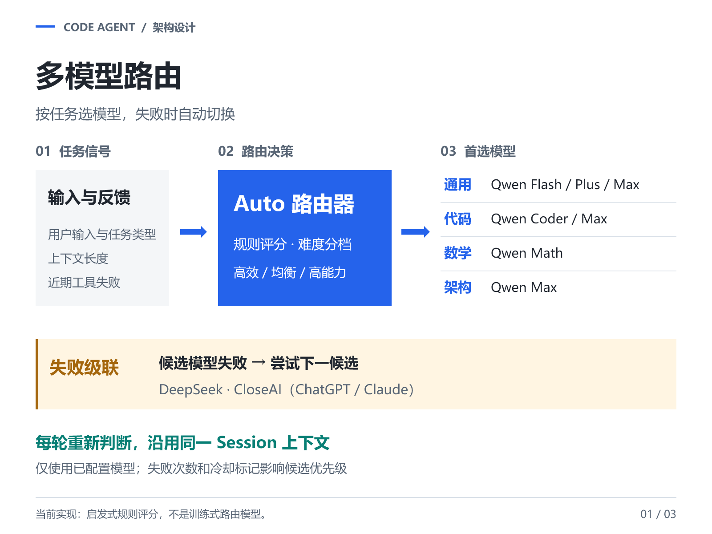
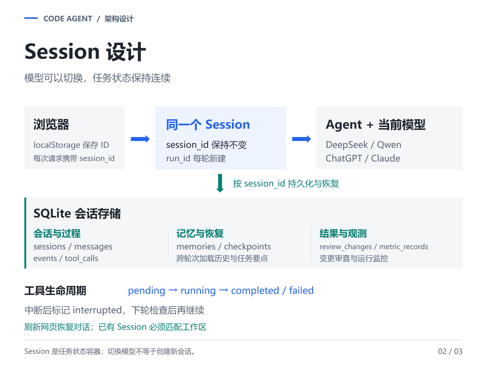
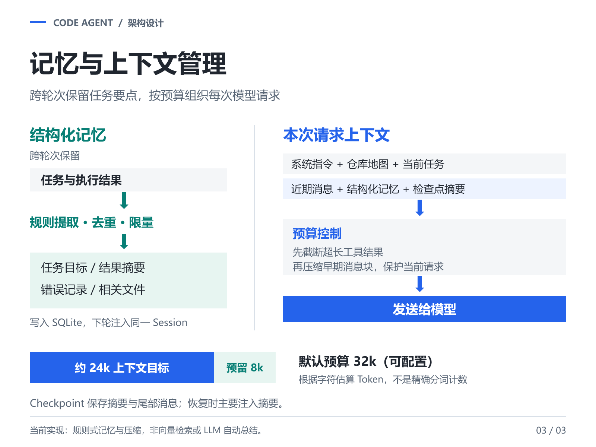

<div align="center">

# Code Agent

**从一次模型调用，到可执行、可恢复、可观测的编程任务。**

Python 编排 · 多模型路由 · Session 持久化 · 记忆与上下文管理

[GitHub](https://github.com/dmtl11/code-agent) · [快速开始](#快速开始) · [设计重点](#设计重点) · [工具与模式](#工具与模式) · [运行与验证](#运行与验证)

</div>

---

Code Agent 是一个轻量的本地 Coding Agent Harness。它不依赖大型 Agent 编排框架，而是自行实现模型适配、工具调用循环、会话存储、上下文整理和执行反馈，让模型能够读取仓库、修改代码、运行验证，并根据错误继续修复。

网页提供文件树、可编辑代码区、聊天、Review 和 Monitor；命令行入口适合脚本调用与任务评测。

## 项目一览

| 设计重点 | 实现方式 | 解决的问题 |
| --- | --- | --- |
| 多模型路由 | 任务识别、复杂度评分、候选排序与失败级联 | 在不同任务与请求失败时调整模型选择 |
| Session 会话 | SQLite 持久化，区分 `session_id` 与 `run_id` | 刷新页面、继续提问或切换模型时保持任务连续 |
| 结构化记忆 | 规则提取任务、结果摘要、错误与文件路径 | 让后续请求保留必要的项目要点 |
| 上下文管理 | 历史分组、工具结果截断、早期步骤压缩、检查点 | 控制请求规模，减少无关历史占用 |
| 编辑与验证 | 代码注册表、按行阅读、局部替换、多文件补丁、语法检查 | 将生成代码变成可检查的修改过程 |
| 服务与观测 | 后台服务管理、变更审查、用量和错误监控 | 不只展示回答，也检查执行结果 |

## 快速开始

### 1. 获取项目

需要 **Python 3.10+**。核心运行路径使用 Python 标准库；运行生成的 Node 项目需要 Node.js/npm，编译 C++ 需要可用的 `g++`、`clang++` 或 MSVC 环境。生成项目自身的依赖需要另行准备。

```powershell
git clone https://github.com/dmtl11/code-agent.git
cd code-agent

# 已有配置时不覆盖，避免丢失 API Key。
if (-not (Test-Path config/llm.env)) {
    Copy-Item config/llm.env.example config/llm.env
}
```

macOS/Linux 可使用 `test -f config/llm.env || cp config/llm.env.example config/llm.env` 创建配置文件。本文启动示例以 Windows 为主。

### 2. 配置模型

编辑 `config/llm.env`，只填写实际使用的服务。完整字段见 [配置模板](config/llm.env.example)。

| 界面选项 / Provider | 凭据与配置 | 说明 |
| --- | --- | --- |
| Auto / `auto` | 复用下列已配置服务 | 不需要独立的 Auto API Key |
| Qwen / `qwen` | `QWEN_API_KEY`，也接受 `DASHSCOPE_API_KEY` | Auto 可进一步选择 Qwen 家族中的不同模型 |
| DeepSeek / `deepseek` | `DEEPSEEK_API_KEY` | 独立选择或参与 Auto 候选队列 |
| ChatGPT / `openai` | `CLOSEAI_API_KEY`、`CLOSEAI_BASE_URL`、`CLOSEAI_OPENAI_MODEL` | 本项目使用 CloseAI 中转 |
| Claude / `claude` | 同一 CloseAI Key、`CLOSEAI_CLAUDE_MODEL` | 根据中转能力选择 OpenAI 兼容或 Anthropic 协议 |

以下是配置结构，不是可直接调用的完整凭据：

```dotenv
CODE_AGENT_PROVIDER=auto
QWEN_API_KEY=
DEEPSEEK_API_KEY=

CLOSEAI_API_KEY=
CLOSEAI_BASE_URL=
CLOSEAI_OPENAI_MODEL=
CLOSEAI_CLAUDE_MODEL=
CLOSEAI_OPENAI_PROTOCOL=openai
CLOSEAI_CLAUDE_PROTOCOL=openai

CODE_AGENT_CONTEXT_TOKENS=32000
CODE_AGENT_REPO_MAP_CHARS=6000
CODE_AGENT_AUTO_EFFICIENT_MAX_SCORE=2
CODE_AGENT_AUTO_BALANCED_MAX_SCORE=5
```

Qwen 家族模型通过 `QWEN_FLASH_MODEL`、`QWEN_CODER_MODEL`、`QWEN_MATH_MODEL`、`QWEN_PLUS_MODEL`、`QWEN_MAX_MODEL` 配置。模型 ID、工具调用能力与可用区域以账户实际支持情况为准；填入 Key 不代表所有候选模型都可用。如果 CloseAI 的 Claude 入口采用原生 Messages 协议，将 `CLOSEAI_CLAUDE_PROTOCOL` 改为 `anthropic`。

> `config/llm.env` 已加入 `.gitignore`。不要把真实 Key、私有会话或生成项目中的敏感数据上传到仓库。

### 3. 启动网页

```powershell
python run.py --web --host 127.0.0.1 --port 8767
```

打开 **[http://127.0.0.1:8767](http://127.0.0.1:8767/)**，选择工作区、模式和模型后开始任务。工作区路径应位于本项目目录内。端口已占用时改用其他端口。

## 设计重点

### 多模型路由：按任务选择，失败时级联

`AutoRoutingModel` 在每次模型请求前读取任务类型、输入长度、上下文规模和近期工具失败，使用可配置阈值区分高效、均衡和高能力档位。

| 任务类型 | 首选策略 |
| --- | --- |
| 一般任务 | 按档位选择 Qwen Flash / Plus / Max |
| 代码任务 | 优先 Qwen Coder，高复杂度时选择 Max |
| 数学任务 | 优先 Qwen Math |
| 架构任务 | 优先 Qwen Max |

路由器过滤未配置的服务，结合失败次数与冷却标记排序，再逐个尝试候选。候选可包括其他 Qwen 模型、DeepSeek，以及经 CloseAI 接入的 ChatGPT、Claude。冷却用于降低优先级，不是绝对禁止调用；全部候选失败会明确返回错误。

这是一套**启发式规则路由与异常回退机制**，不是训练式分类器，也不是多个模型同时投票。工具失败可影响下一次选择，但目前没有独立模型评审答案质量，不承诺每次都选到最优模型或固定节省比例。



实现入口：[model_router.py](src/code_agent/model_router.py) · [model.py](src/code_agent/model.py) · [config.py](src/code_agent/config.py)

### Session：模型会变，任务身份不变

浏览器在 localStorage 中保存 `session_id`；后端验证它存在且绑定正确工作区，为每轮请求创建新的 `run_id`，然后读取同一会话的历史与记忆。切换模型只改变本轮调用对象，不会另建 Session。

数据保存在 `.code_agent/sessions.sqlite3`，包含消息、事件、记忆、检查点、工具调用、代码审查和监控记录。工具状态按 `pending → running → completed / failed` 流转；下一轮发现遗留的未完成调用时，标记为 `interrupted` 并提供检查提示，不直接重放命令。

清空会话会移除该 Session 的对话、记忆等记录，但不会回滚工作区代码，也不会代替停止服务操作。

<details>
<summary>查看 Session 结构图</summary>



</details>

实现入口：[session_store.py](src/code_agent/session_store.py) · [agent.py](src/code_agent/agent.py) · [server.py](src/code_agent/server.py)

### 记忆：用 Hermes 的思路理解，保留必要要点

可以用 Hermes 的“持久笔记与临时对话分离”来理解这里的设计。Hermes 将笔记和用户信息持久保存，在会话开始时注入记忆快照；本项目采用更轻量的**Session 级结构化记忆**，通过规则收集任务目标、结果摘要、已知错误和相关文件，去重、限量后写入 SQLite，并在后续请求中注入。[Hermes 官方说明](https://hermes-agent.nousresearch.com/docs/user-guide/which-file-does-what)

当前并未复现 Hermes 的全局跨会话用户画像、主动记忆管理工具或冻结快照。结果摘要也不等于已经独立验证的成功结论，仍需结合工具输出和测试判断。

### 上下文：类比 Claude Code，先整理再压缩

Claude Code 将上下文视作有限资源，在接近上限时清理旧工具输出并压缩对话。本项目在理念上与之相近，但使用**本地规则截断与摘要**，没有调用 Claude 原生压缩接口，也不依赖另一个 LLM 总结历史。[Claude Code 官方说明](https://code.claude.com/docs/en/how-claude-code-works#the-context-window)

1. 从数据库加载近期历史，保持 assistant 工具调用与对应结果成组，清理孤立或不完整消息。
2. 组装系统指令、仓库地图、记忆、检查点摘要、近期历史与当前任务。
3. 将超过 4000 字符的工具结果截断为前 3600 字符及提示。
4. 超过目标预算时，压缩早期消息块并保护当前请求，摘要只保留近期条目。
5. 发生压缩时保存 checkpoint，记录摘要、尾部消息和估算量；恢复时主要注入摘要。

默认总预算为 **32k**，预留约 **8k** 输出空间，约 **24k** 作为压缩目标。Token 数按字符近似估算，不是精确 tokenizer 计数；当受保护内容本身过大时，也不能保证严格卡在预算内。配置预算不会扩展模型或中转平台的真实上下文上限。

<details>
<summary>查看记忆与上下文示意图</summary>



</details>

实现入口：[memory.py](src/code_agent/memory.py) · [context.py](src/code_agent/context.py)

## 工具与模式

| 模式 | 能做什么 | 权限边界 |
| --- | --- | --- |
| Code | 检索、编辑、检查、执行与服务管理 | 可改变工作区并运行程序 |
| Ask | 回答仓库问题、查询已有服务 | 只读，不写文件或执行命令 |
| Plan | 分析方案、列出修改和验证步骤 | CLI 参数为 `architect`，不执行修改 |
| Context | 展示仓库地图与保留上下文估算 | 不调用模型，不自动修改代码 |

| 工具组 | 主要工具 | 作用 |
| --- | --- | --- |
| 仓库理解 | `repo_map`、`list_files`、`search_files`、`read_file` | 结合持久化代码注册表，先定位再分段阅读 |
| 代码修改 | `replace_in_file`、`write_file`、`apply_patch`、`rollback_patch` | 唯一匹配、局部替换、补丁预演与冲突检查 |
| 检查与执行 | `lint_file`、`run_command` | 语法检查、有限时长验证及明确的无输出提示 |
| 开发服务 | `start_service`、`service_status`、`service_logs`、`stop_service` | 启动、就绪探测、日志读取与进程树清理 |

服务工具使用参数数组启动程序，不需要 `start /b` 或 `Start-Process`。未指定端口时只确认进程存活；指定端口时检查 TCP，额外指定 `health_path` 时验证 HTTP 2xx。启动超时会清理本次进程树，不会杀死占用端口的无关程序。

**服务随 Web 后端存活，可跨轮次、跨模型管理；关闭后端后需要重新启动。** 单次 CLI 退出也会清理托管服务。网页 Terminal 目前是输出区域，不是交互式 shell；Run File 支持 Python 运行和 C++ 编译运行。

## 运行与验证

### 命令行

```powershell
python run.py "检查项目，修复错误并运行测试" --workspace workspace --provider auto --max-turns 24
python run.py "解释这个项目的主要模块" --workspace workspace --mode ask
python run.py "规划新增排行榜接口" --workspace workspace --mode architect
```

Code 模式的基本过程是：**定位代码 → 阅读与检查 → 修改 → 验证 → 根据反馈继续**。Web/CLI 默认最多 24 轮，不保证任意大小任务都在一次请求内完成。

### 两种演示方式

**修复错误：**准备独立的缺陷示例与有效测试，让 Agent 先复现失败，再做最小修改并重新验证。不要通过削弱测试让结果变绿；在 Review 中检查实际 Diff。

**从零构建：**在空工作区用两轮请求演示，保留同一 Session：

```text
第一轮：实现网页版贪吃蛇，前端放 frontend，后端用 Python 标准库和 SQLite 保存得分、提供排行榜。完成后测试并修复错误，先不启动常驻服务。

第二轮：启动刚才的游戏，检查网页与排行榜接口。失败时读取服务日志并修复，成功后给出访问地址和服务 ID。
```

### 测试与评测

```powershell
# 本地回归：模拟模型，不调用付费 API；部分用例启动临时本机服务。
python -m unittest discover -s tests -v

# 真实 Agent 任务评测：需要模型配置，会调用 API 并在 eval_runs 中写文件。
python run.py --eval --max-turns 24 --keep
```

回归覆盖模型适配、路由规则、工具权限、补丁冲突、历史消息配对、会话记忆、服务生命周期及监控。评测默认会重建工作目录；示例使用 `--keep` 避免清空旧目录，但个别用例仍会写入同名文件。详见 [评测说明](docs/evaluation.md)。

Review 展示代码变更并支持选择回滚或合并多次修改；文件已经实际写入，不需要点击 Accept 才生效。Monitor 展示请求量、Token、缓存用量、平均/P95 延迟和错误率。真实 `usage` 与估算值会区分记录，估算值不作为正式账单。

## 项目结构

```text
code-agent/
  run.py                        Web / CLI / 评测入口
  config/llm.env.example         模型与上下文配置模板
  src/code_agent/
    agent.py                    任务循环与模式权限
    model.py                    OpenAI 兼容 / Anthropic 协议适配
    model_router.py             Auto 任务识别与失败级联
    session_store.py             SQLite 会话与运行记录
    memory.py / context.py      结构化记忆与上下文预算
    code_registry.py            文件、符号及关系注册表
    repo_map.py                  紧凑仓库上下文
    tools.py / patching.py       工具执行与补丁事务
    services.py                 后台服务生命周期
    server.py                   网页与 API 服务
  web/                          文件树、编辑器、Chat、Review、Monitor
  tests/                        本地回归测试
  docs/                         技术说明、演示图与迭代报告
  PROJECT_OVERVIEW.txt           项目实现简述
```

## 安全与边界

- 这是面向本机开发与实验的原型，不是多用户生产服务。建议只监听 `127.0.0.1`。
- 文件工具校验工作区路径，命令工具有常见危险模式拦截与超时，但这**不等于操作系统沙箱**；启动的代码拥有当前用户权限。
- Session 持久化的是任务记录，不代表原进程能断点续跑；服务重启后不会仅凭历史 PID 接管其他程序。
- 记忆、摘要与模型回复都可能遗漏信息。测试输出、服务就绪检查和实际 Diff 才是验证依据。
- Auto 当前没有训练式路由、答案质量评审或真实价格优化器；记忆当前没有跨 Session 自动检索或向量数据库。

## 延伸阅读

- [约 900 字项目说明](PROJECT_OVERVIEW.txt)
- [三张架构图与可编辑 PPT](docs/architecture-slides/)
- [项目迭代报告](docs/code-agent-iteration-report.md)
- [Hermes：持久笔记、用户信息与会话快照](https://hermes-agent.nousresearch.com/docs/user-guide/which-file-does-what)
- [Claude Code：上下文窗口与压缩](https://code.claude.com/docs/en/how-claude-code-works)

Hermes 与 Claude Code 用于设计对照，不是本项目的运行依赖，也不代表已完整复现其机制。
